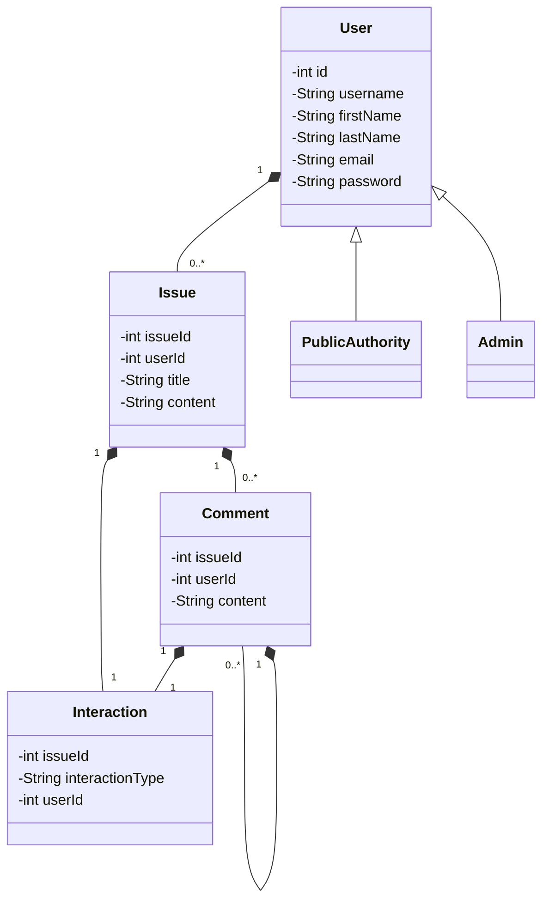

[](https://classroom.github.com/a/j48a217e)


# SpotLight

## Human Rights Violation Reporting Platform

## About The Project
The Human Rights Violation Reporting Platform is a web-based application designed to empower individuals to report and document human rights violations. It provides tools for users to describe incidents, categorize them, and tag locations, facilitating community involvement and official oversight.

### Key Features
- **Personal Profiles:** Users can view and manage their reported issues and comments.
- **Issue Reporting:** A detailed form allows users to describe incidents, select categories, and tag locations.
- **Community Engagement:** Users can comment on and upvote issues to increase visibility.

## Getting Started
To get a local copy up and running follow these simple steps.

### Prerequisites
This project uses npm as a package manager. You need to install npm if you haven't yet.
```bash
npm install npm@latest -g
```

### Installation

1. Clone the repo
```bash
git clone https://github.com/info-6150-spring-2024/final-project-spotlight.git
```
2. nstall NPM packages
```bash
npm install
```
3. Set up your environment variables
```
edit .env
```
4. Run the application
```
npm start
```

## Usage
Landing Page


Issue Page


Authorities Page


User Profile Page


Issue Form


## Authors

- [Parv Patel (002845159)](https://github.com/ParvPatel01/) - patel.parv1@northeastern.edu
- [Meet Karnik (002795334)](https://github.com/karnikmeet/) - karnik.me@northeastern.edu
- [Sanath LNU (002672508)](https://github.com/SanathLNU/) - lnu.sanat@northeastern.edu
- [Chiragkumar Maisuria (002813605)](https://github.com/ChiragMaisuria01/) - maisuria.c@northeastern.edu

## Acknowledgments
- [MongoDB](https://www.mongodb.com/)
- [Express](https://expressjs.com/)
- [React](https://reactjs.org/)
- [Node.js](https://nodejs.org/)

Mermaid code for Object Model

# Object Model


