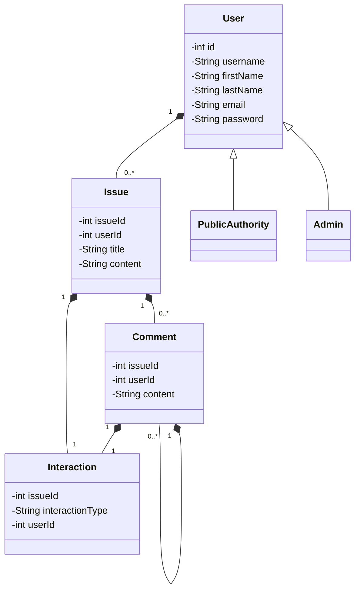

# Object Model

```mermaid
---
Object Model for Spotlight

---
classDiagram

  class User{
    -int id
    -String username
    -String firstName
    -String lastName
    -String email
    -String password
  }

  class Issue{
    -int issueId
    -int  userId
    -String title
    -String content
  }
  class Interaction{
    -int issueId
    -String interactionType
    -int userId
  }
  class Comment{
    -int issueId
    -int userId
    -String content
  }

    User <|--PublicAuthority
    User <|--Admin

    User "1"*--"0..*" Issue
    Issue "1" *--"0..*" Comment
    Comment "1" *--"1" Interaction
    Issue "1" *-- "1" Interaction
    Comment "1" *-- "0..*" Comment

```